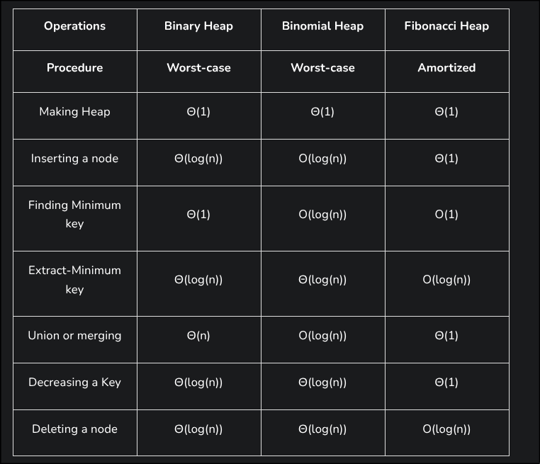

# Motivation

Refer the usage of other types of heaps; Binary heap(Simple complete binary tree, meaning its filled from left to right, and nodes can have up to 2 children) and Binomial heap(collection of binomial trees, aka trees with size 2^k).

Fibonnaci heap is actually an extension of binomial heap, but much more complex.

Priority updates, "Decreasing the key" generaly is more costly in graph networks because of the difference between number of Edges >= Vertices.
So "decrease-key" of a node turns into amortized O(1), that is decrease-key computes a change of a node's value and rearanges the tree(In case of fibonacci this does not happen, slightly simpler). 

Amortized means that on average computing time is constant but can vary depending on circumcitances 

