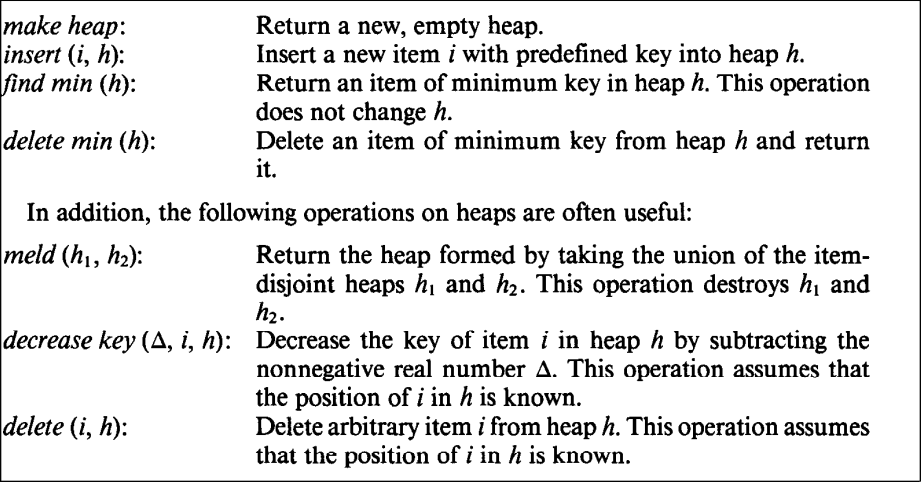

# Motivation

Refer the usage of other types of heaps; Binary heap(Simple complete binary tree, meaning its filled from left to right, and nodes can have up to 2 children) and Binomial heap(collection of binomial trees, aka trees with size 2^k).

Fibonnaci heap is actually an extension of binomial heap, but much more complex.

Priority updates, "Decreasing the key" generaly is more costly in graph networks because of the difference between number of Edges >= Vertices.
So "decrease-key" of a node turns into amortized O(1), that is decrease-key computes a change of a node's value and rearanges the tree(In case of fibonacci this does not happen, slightly simpler). 

Amortized means that on average computing time is constant but can vary depending on circumcitances 


# How it works

Pseudo code operations:

https://www.cs.princeton.edu/~wayne/cs423/fibonacci/FibonacciHeapAlgorithm.html

**Rank** of a node is the number of children.

Pointer to parent can be null. (This happens if the node is the "main" root of a tree)

## Operations



make heap: creates an empty heap, return null_ptr

```
Make-Fibonacci-Heap()
n[H] := 0
min[H] := NIL 
return H
```

find min(h): O(1) returns pointer that is previouly set to point to the minimum node.

insert (i, h): inserts new heap consisting of one node, with key i. To do this we need to compute meld(h1,h2). Meld basically combines the root of h1 and h2 into a single list. Basically the root list just concatenates the new heap to it, and changes the min pointer if needed.


delete/extract min (h):

1. Firstly remove node x from root list, and add its children to the root node list. 
2. Enter Consolidate step
    - Iterate the global root list and find trees that have the same degree/rank, and link them toghether.
    - **Linking**: Compare tree roots. Put the larger root node as the child with the smaller root value. This will create a new single tree with degree/rank + 1.
    - Keep on reapeating this process until every single tree on the root list has a unique degree.
3. Finally update global min pointer.


decrease key (Δ, i, h): Where delta is the decrease of the key i in the heap h. 

1. Lower the value of the nodes key. If the parent value is still smaller then the children value do nothing. (Can have the need to update the min pointer value.)
2. Else the rule is broken need to fix it.
3. Cascading cut (Chain reaction)
   - If the x node we are changing is a child of a global root node, we remove the edge between x and its parent and put it into the global root list.
   - If the 