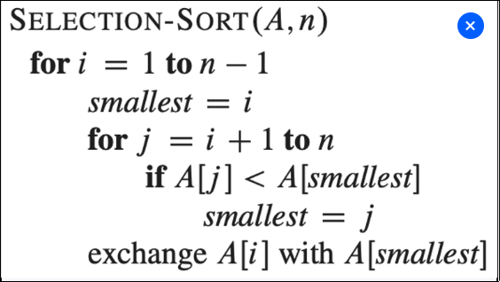

# Is 2^(2n) = O(2^n)? Prove it!

No, because as the "declaration" says about the O(f(n)), we have to find a value c that is positive and get an upper bound for the 2^(2n). 
For example to have an upper bound of with f(n)*c >= 2^(2n),
our c would need to be at best 2^n, but thats not constant so it mainly depends on the size of n.

# Is 2^(n+1) = O(2^n)? Prove it!

Yes, because we can find a value c that is positive and get an upper bound for the 2^(n+1).
For example to have an upper bound of with f(n)*c >= 2^(n+1),
our c would need to be at best 2, which is constant and does not depend on the size of n.

## Exercise

Using reasoning similar to what we used for insertion sort,
analyze the running time (O, Θ, Ω) of the selection sort algorithm.

For selection-sort, the number of executions does not depend if the array is sorted or not. When checking the times of execution,the outer for loop,runs (n-1) times and the inner loop at most (n-1) times. So in this case would be (n-1)*(n-1). So we can assume that O(n²) can be an upper bound. Ω(n²) can also be a lower bound as some cases we run less times. So by having O(n²) and Ω(n²) we can also say that Θ(n²) is a tight bound for this algorithm.